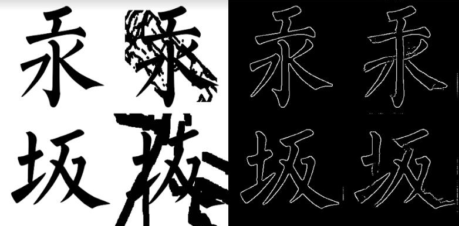
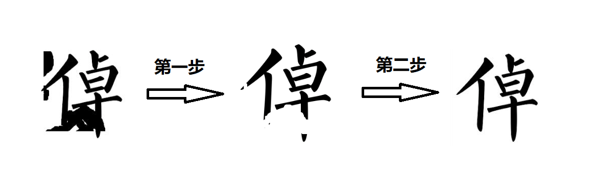

## Introduction:

The task:



The 1st columns are the original image. 
The 2nd columns are the 'stained' image. 
The 3rd columns are the original character's edges.
And the 4th columns are the what we want to get from input(2nd column).

You can comprehend this process as following, and GAN achieve it at a single step:



We use a modified edge-connect model to realize it. 

We remain the edge model and remove the useless inpainting model in this task.
The input is composed of the 'stained' image and the 'stained' edge, as in this task, you can not recognize the missing part in the input image. 
Therefore it's not a purely inpainting problem actually.

You can get more information about this repo from the [edge-connect repo](https://github.com/knazeri/edge-connect.git).
## Instuctions

### Dataset
You can get the dataset from [character-dataset](https://drive.google.com/file/d/1E6RjB-joflTbG5Ixs9gdT0lVhiy2A2aQ/view?usp=sharing).

### Pretrained models
You can get the trained checkpoints from [checkpoints](https://drive.google.com/file/d/1_dVcmmbmFAZOnf13jfCkaimOkLfxjpeJ/view?usp=sharing).

### Test
Test the model on the testing set:
```
python test.py --checkpoints ./checkpoints_dir --output ./output_dir
```
And you can config the behavior in the config.yml file in the **'checkpoints_dir'**. 
You can get more detail about the config file from [edge-connect repo](https://github.com/knazeri/edge-connect.git).

### Train
Train the model:

```
python train.py --checkpoints ./checkpoints_dir
```

